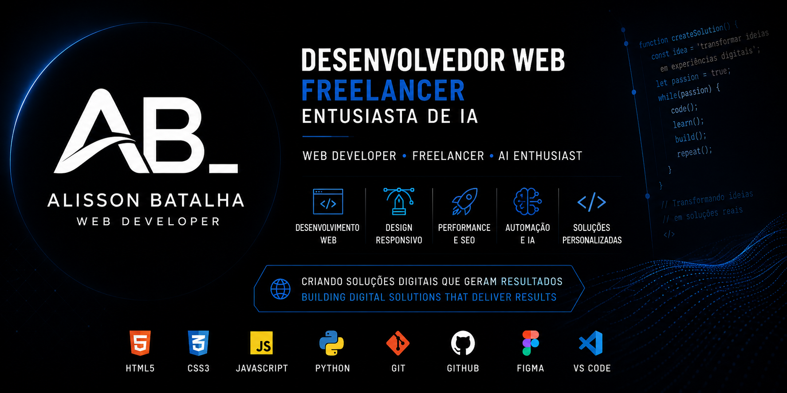

 

 

  

🚀 Alisson Batalha

Web Developer • Freelancer • AI Enthusiast

 
---

🇧🇷 Sobre Mim

Olá! Sou Alisson Batalha, desenvolvedor web freelancer apaixonado por tecnologia, design e criação de soluções digitais.

Meu foco é desenvolver sites modernos, landing pages responsivas e experiências web que ajudam empresas e profissionais a crescerem no ambiente digital.

Atualmente estou aprofundando meus conhecimentos em Python, Inteligência Artificial, Automação e Desenvolvimento Web Moderno.

🇺🇸 About Me

Hello! I'm Alisson Batalha, a freelance web developer passionate about technology, design and digital solutions.

My focus is building modern websites, responsive landing pages and web experiences that help businesses and professionals grow their digital presence.

Currently improving my skills in Python, Artificial Intelligence, Automation and Modern Web Development.

---

💼 Disponível para Freelas | Available for Freelance Work

🇧🇷 Serviços

✅ Landing Pages

✅ Sites Institucionais

✅ Portfólios Profissionais

✅ Desenvolvimento Front-End

✅ Design Responsivo

✅ Manutenção de Websites

✅ Otimização de Performance

✅ Melhorias de Interface (UI)

🇺🇸 Services

✅ Landing Pages

✅ Business Websites

✅ Professional Portfolios

✅ Front-End Development

✅ Responsive Design

✅ Website Maintenance

✅ Performance Optimization

✅ UI Improvements

---

🛠️ Tecnologias | Technologies

Front-End

Atualmente Aprendendo | Currently Learning

Ferramentas | Tools

---

📊 Estatísticas GitHub | GitHub Statistics

---

🔥 Sequência de Contribuições | Contribution Streak

---

📈 Gráfico de Atividade | Activity Graph

---

🏆 Conquistas GitHub | GitHub Trophies

---

🐍 Snake Contributions

---

🚀 Projetos em Destaque | Featured Projects

🧮 Age Calculator

🇧🇷 Calculadora de idade interativa construída com HTML, CSS e JavaScript.

🇺🇸 Interactive age calculator built with HTML, CSS and JavaScript.

---

🍽 Restaurant Landing Page

🇧🇷 Landing page moderna para restaurantes focada em experiência do usuário e conversão.

🇺🇸 Modern restaurant landing page focused on user experience and conversion.

---

💼 Professional Portfolio

🇧🇷 Portfólio profissional desenvolvido para apresentar projetos, habilidades e serviços.

🇺🇸 Professional portfolio built to showcase projects, skills and services.

---

📚 Atualmente Estudando | Currently Learning

🇧🇷

- Python
- Inteligência Artificial
- Ciência de Dados
- Automação
- JavaScript Avançado

🇺🇸

- Python
- Artificial Intelligence
- Data Science
- Automation
- Advanced JavaScript

---

🎯 Objetivos para 2026 | Goals for 2026

🇧🇷

- Expandir minha carreira freelancer
- Trabalhar com clientes internacionais
- Dominar Python
- Construir projetos avançados
- Desenvolver soluções com IA
- Criar um portfólio de alto nível

🇺🇸

- Grow my freelance business
- Work with international clients
- Master Python
- Build advanced projects
- Develop AI-powered solutions
- Create a world-class portfolio

---

🌐 Contato | Connect With Me

---

⚡ Curiosidades | Fun Facts

🇧🇷

- Amo desenvolvimento web
- Gosto de aprender novas tecnologias
- Tenho grande interesse por IA e automação
- Acredito em melhoria contínua

🇺🇸

- Passionate about web development
- Love learning new technologies
- Interested in AI and automation
- Believe in continuous improvement

---

💡 Filosofia | Philosophy

Code • Learn • Build • Repeat

"Pequenas melhorias todos os dias geram resultados extraordinários."

"Small improvements every day lead to extraordinary results."

---

⭐ Obrigado pela visita!

⭐ Thanks for visiting!

🚀 Aberto para oportunidades freelancer

🚀 Open to freelance opportunities

